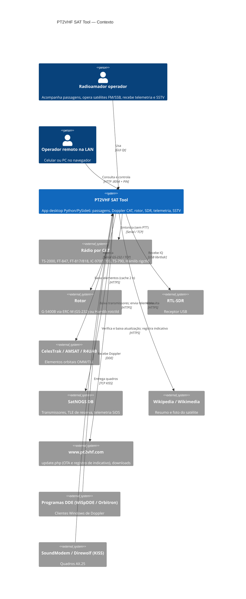

# C4 Contexto — PT2VHF SAT Tool

> Reversa (Arquiteto), 27/11/2026. 🟢 CONFIRMADO salvo indicação.

```mermaid
C4Context
title PT2VHF SAT Tool — Contexto
Person(op, "Radioamador operador", "Acompanha passagens, opera satélites FM/SSB, recebe telemetria e SSTV")
Person(remoto, "Operador remoto na LAN", "Celular ou PC no navegador")
System(sat, "PT2VHF SAT Tool", "App desktop Python/PySide6: passagens, Doppler CAT, rotor, SDR, telemetria, SSTV")
System_Ext(radio, "Rádio por CAT", "TS-2000, FT-847, FT-817/818, IC-9700/705, TS-790, Hamlib rigctld")
System_Ext(rotor, "Rotor", "G-5400B via ERC-M (GS-232) ou Hamlib rotctld")
System_Ext(sdr, "RTL-SDR", "Receptor USB")
System_Ext(celestrak, "CelesTrak / AMSAT / R4UAB", "Elementos orbitais OMM/TLE")
System_Ext(satnogs, "SatNOGS DB", "Transmissores, TLE de reserva, telemetria SiDS")
System_Ext(wiki, "Wikipedia / Wikimedia", "Resumo e foto do satélite")
System_Ext(site, "www.pt2vhf.com", "update.php (OTA e registro de indicativo), downloads")
System_Ext(dde, "Programas DDE (WiSpDDE / Orbitron)", "Clientes Windows de Doppler")
System_Ext(tnc, "SoundModem / Direwolf (KISS)", "Quadros AX.25")
Rel(op, sat, "Usa", "GUI Qt")
Rel(remoto, sat, "Consulta e controla", "HTTP :8094 + PIN")
Rel(sat, radio, "Sintoniza (sem PTT)", "Serial / TCP")
Rel(sat, rotor, "Aponta", "Serial GS-232 / TCP")
Rel(sat, sdr, "Recebe IQ", "USB librtlsdr")
Rel(sat, celestrak, "Baixa elementos (cache 2 h)", "HTTPS")
Rel(sat, satnogs, "Baixa transmissores; envia telemetria", "HTTPS")
Rel(sat, wiki, "Consulta", "HTTPS")
Rel(sat, site, "Verifica e baixa atualização; registra indicativo", "HTTPS")
Rel(dde, sat, "Recebe Doppler", "DDE")
Rel(tnc, sat, "Entrega quadros", "TCP KISS")
```
