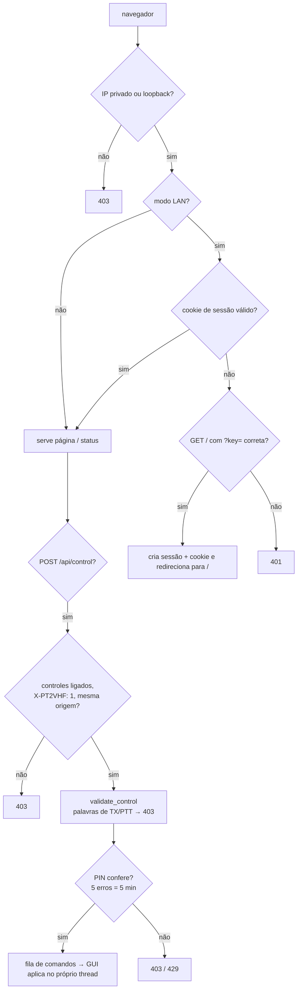

# Fluxo — Painel web e controle remoto

```mermaid
flowchart TD
  B[navegador] --> IP{IP privado ou loopback?}
  IP -- não --> F403[403]
  IP -- sim --> L{modo LAN?}
  L -- não --> OK[serve página / status]
  L -- sim --> CK{cookie de sessão válido?}
  CK -- sim --> OK
  CK -- não --> K{GET / com ?key= correta?}
  K -- sim --> SC[cria sessão + cookie e redireciona para /]
  K -- não --> U401[401]
  OK --> P{POST /api/control?}
  P -- sim --> C{controles ligados,<br/>X-PT2VHF: 1, mesma origem?}
  C -- não --> F2[403]
  C -- sim --> V[validate_control<br/>palavras de TX/PTT → 403]
  V --> PIN{PIN confere?<br/>5 erros = 5 min}
  PIN -- sim --> FILA[fila de comandos → GUI aplica no próprio thread]
  PIN -- não --> F3[403 / 429]
```
