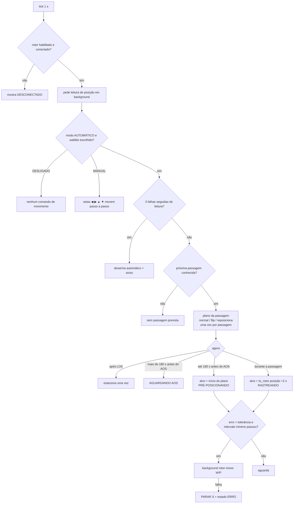

# Fluxo — Rastreamento automático do rotor

> 🟢 `rotor_ui.py: rotor_tick` (chamado pelo `tick` de 1 s)

```mermaid
flowchart TD
  T[tick 1 s] --> A{rotor habilitado e conectado?}
  A -- não --> D[mostra DESCONECTADO]
  A -- sim --> R[pede leitura de posição em background]
  R --> M{modo AUTOMÁTICO e satélite escolhido?}
  M -- DESLIGADO --> O[nenhum comando de movimento]
  M -- MANUAL --> MA[setas ◀ ▶ ▲ ▼ movem passo a passo]
  M -- sim --> F{3 falhas seguidas de leitura?}
  F -- sim --> S[desarma automático + aviso]
  F -- não --> N{próxima passagem conhecida?}
  N -- não --> W[sem passagem prevista]
  N -- sim --> PL[plano da passagem<br/>normal / flip / reposiciona<br/>uma vez por passagem]
  PL --> Q{agora}
  Q -- após LOS --> PK[estaciona uma vez]
  Q -- mais de 180 s antes do AOS --> AG[AGUARDANDO AOS]
  Q -- até 180 s antes do AOS --> PP[alvo = início do plano<br/>PRÉ-POSICIONANDO]
  Q -- durante a passagem --> TR[alvo = to_rotor posição +2 s<br/>RASTREANDO]
  PP --> NM{erro > tolerância e<br/>intervalo mínimo passou?}
  TR --> NM
  NM -- sim --> MV[background rotor-move: W/P]
  NM -- não --> X[aguarda]
  MV -- falha --> STOP[PARAR S + estado ERRO]
```
