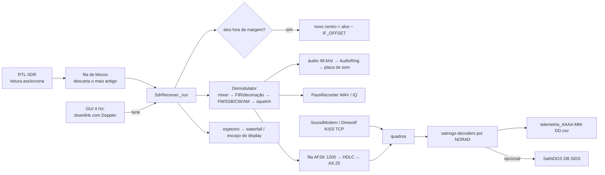

# Fluxo — Receptor RTL-SDR

```mermaid
flowchart LR
  USB[RTL-SDR<br/>leitura assíncrona] --> Q[fila de blocos<br/>descarta o mais antigo]
  Q --> RUN[SdrReceiver._run]
  GUI[GUI 4 Hz:<br/>downlink com Doppler] -->|tune| RUN
  RUN --> RET{alvo fora da margem?}
  RET -- sim --> CF[novo centro = alvo − IF_OFFSET]
  RUN --> DEM[Demodulator<br/>mixer → FIR/decimação → FM/SSB/CW/AM → squelch]
  DEM --> AUD[áudio 48 kHz → AudioRing → placa de som]
  DEM --> REC[PassRecorder WAV / IQ]
  DEM --> AFSK[fila AFSK 1200 → HDLC → AX.25]
  RUN --> SPEC[espectro → waterfall / escopo do display]
  KISS[SoundModem / Direwolf KISS TCP] --> FR[quadros]
  AFSK --> FR
  FR --> DEC[satnogs-decoders por NORAD] --> CSV[telemetria_AAAA-MM-DD.csv]
  DEC -->|opcional| SIDS[SatNOGS DB SiDS]
```
